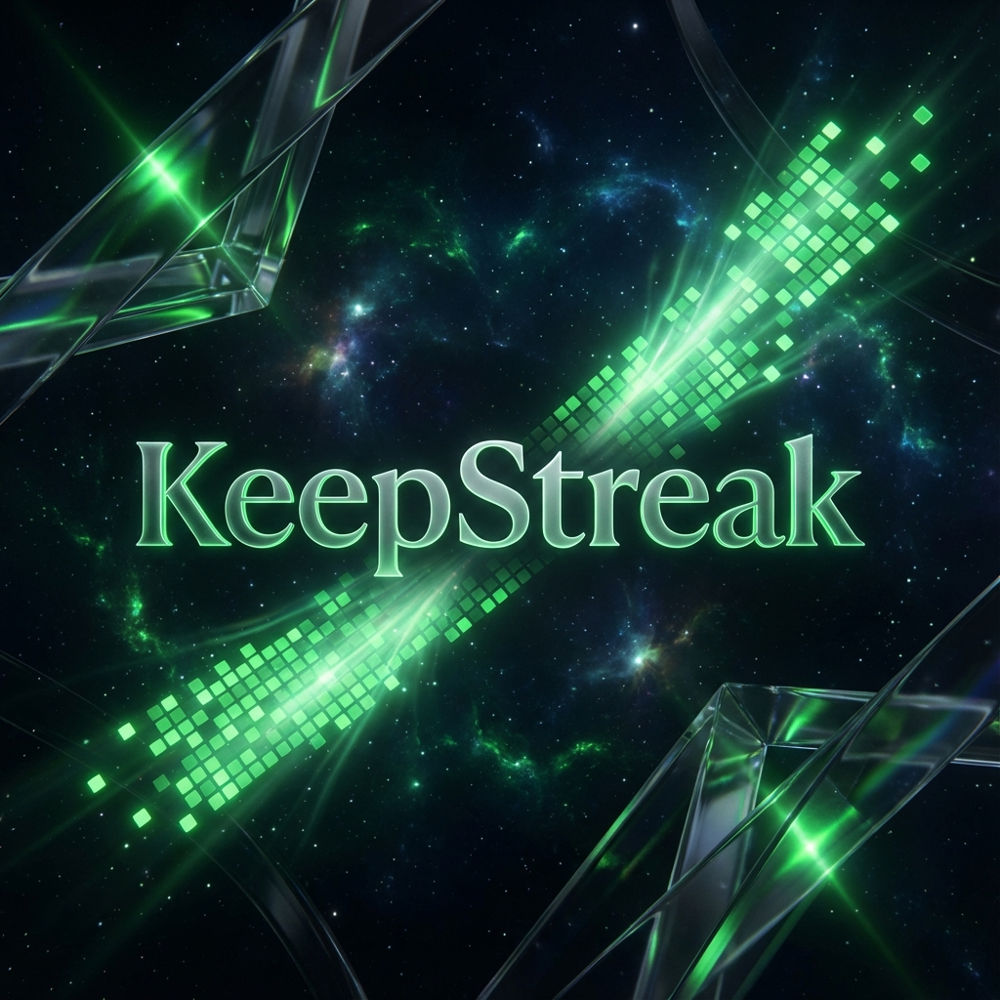

# <p align="center">✨ KeepStreak ✨</p>

<p align="center">
  
</p>

<p align="center">
  <strong>Maintenez votre éclat sur GitHub. Automatiquement. Divinement.</strong><br>
  <em>L'outil ultime pour les développeurs qui ne dorment jamais, même quand ils dorment.</em>
</p>

<p align="center">
  
  
  
  
  
</p>
 
---

> [!IMPORTANT]  
> **Note de l'Auteur : Le Défi avant tout**  
> Je tiens à préciser que ce projet est né avant tout d'un **défi technique majeur** : comment construire une infrastructure capable de gérer des milliers de processus asynchrones ultra-sécurisés en temps réel. Bien que l'outil puisse être perçu comme un moyen de "tromper" les statistiques GitHub, mon intention n'est nullement d'encourager la fraude. Toutes mes excuses si cela est mal interprété ; c'est la complexité du système et la beauté de l'architecture qui me passionnent ici.

---

## 🌌 La Vision
KeepStreak n'est pas qu'un simple script de commit. C'est une plateforme **ultra-haute performance** conçue pour l'élite des développeurs. 

Imaginez une infrastructure capable de gérer **5000+ développeurs** simultanément, garantissant que chaque profil GitHub reste vert, jour après jour, avec une précision chirurgicale et une sécurité absolue.

## 🚀 Fonctionnalités Célestes

- **Automated Pulse** : Détecte l'absence d'activité et injecte un commit "KeepAlive" intelligent avant la fin de la journée.
- **Dashboard Divin** : Une interface moderne, fluide (glassmorphism) pour piloter vos streaks en un coup d'œil.
- **Sécurité Militaire** : Chiffrement de vos tokens GitHub via **AES-256-GCM**. Vos accès sont vos yeux, nous les protégeons.
- **Multi-Rôles** : 
  - 🧑‍💻 **Dev Dashboard** : Statistiques, réglages de fréquence, historique de maintien.
  - 🛡️ **Admin Dashboard** : Monitoring système, gestion de la charge (5000+ users), analytique globale.

## 🛠️ Architecture de Haute Volée

### Tech Stack
- **Monorepo** : Géré par [Turborepo](https://turbo.build/).
- **Engine** : [NestJS](https://nestjs.com/) pour un backend scalable et modulaire.
- **UI** : [Next.js 16](https://nextjs.org/) avec [Tailwind CSS](https://tailwindcss.com/) et [Framer Motion](https://www.framer.com/motion/).
- **Persistence** : [Prisma](https://www.prisma.io/) + [PostgreSQL].
- **Workers** : [BullMQ](https://docs.bullmq.io/) + [Redis] pour le traitement asynchrone massif (5000+ concurrent jobs).

---

## 🏛️ Structure du Projet

```bash
KeepStreak/
├── apps/
│   ├── web/          # Frontend Next.js (Landing & Dashboards)
│   ├── api/          # Backend NestJS (API & Jobs Core)
├── packages/
│   ├── db/           # Schéma Prisma & Client centralisé
│   ├── ui/           # Design System (Custom Components)
│   ├── security/     # Logique de chiffrement AES-256-GCM
│   └── shared/       # Types et constantes partagés
├── infrastructure/   # Configurations Docker, Redis, Postgres
└── assets/           # Ressources visuelles premium
```

## 🔒 Sécurité
Nous traitons vos tokens comme des reliques sacrées. Chaque jeton est :
1. Chiffré au repos via AES-256-GCM.
2. Isolé dans des processus de workers sécurisés.
3. Jamais exposé au frontend.

---

<p align="center">
  Réalisé avec ❤️ par un passionné de défis techniques.
</p>
