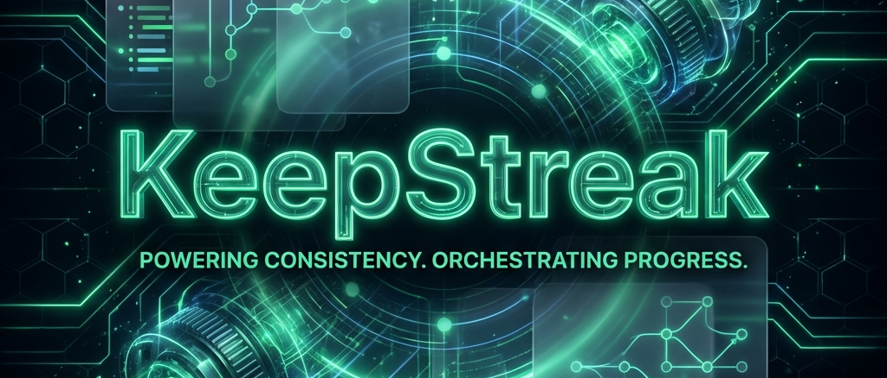

  

<h1 align="center">✨ KeepStreak ✨</h1>

  <strong>Orchestration distribuée. Sécurité Zero-Token. Excellence visuelle.</strong> 
  <em>Maintenez votre présence sur GitHub avec l'élégance d'un Shadow Worker.</em>

  
  
  
  

---

## 🌌 La Vision Cyber-Premium
**KeepStreak** n'est pas qu'un outil d'automatisation ; c'est une démonstration d'ingénierie logicielle avancée. Conçu pour les développeurs exigeants, il combine la robustesse structurelle de **Cal.com** avec l'esthétique immersive de **Framer**.

> [!IMPORTANT]
> **Focus Ingénierie** : Ce projet explore la gestion de flux asynchrones massifs (5000+ workers) et la sécurité cryptographique décentralisée. L'aspect "streak" est le terrain de jeu d'une architecture distribuée complexe.

## 🚀 Fonctionnalités Clés
- **Shadow Handshake** : Activation sécurisée via HMAC sans stockage de tokens permanents.
- **Pulse Engine** : Scheduler intelligent avec injection de **Jitter** pour un comportement humain.
- **Stealth Monitoring** : Dashboard "Glassmorphism" pour un suivi en temps réel de votre infrastructure.
- **Zero-Token Storage** : Vos accès GitHub ne quittent jamais votre environnement sécurisé.

## 📚 Documentation Hub
L'intégralité du projet est documentée de manière modulaire :

| Section | Contenu |
| :--- | :--- |
| **🎨 [Design Hub](docs/design/index.md)** | Principes UX, Tokens UI, Strategy & Case Studies. |
| **🏗️ [Architecture](docs/architecture/index.md)** | ADRs, Systèmes distribués et schémas Redis. |
| **🛡️ [Sécurité](docs/security/index.md)** | Détails des protocoles HMAC et isolation. |
| **📦 [Produit](docs/product/index.md)** | PRD, Epics, Stories et Readiness Reports. |

---

## 🛠️ Architecture Technique
- **Monorepo** : [Turborepo](https://turbo.build/)
- **Backend** : [NestJS](https://nestjs.com/) + [Redis Streams]
- **Frontend** : [Next.js 16](https://nextjs.org/) + [Framer Motion](https://www.framer.com/motion/)
- **Database** : [Prisma](https://www.prisma.io/) + [Neon PostgreSQL]

   
  <a href="docs/README.md"><strong>Explorer la documentation complète →</strong></a>

---

  Réalisé avec ❤️ par un passionné de défis techniques.

