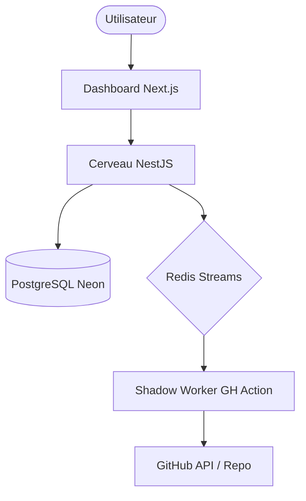

# Architecture Système

## Vision Technique
**KeepStreak** repose sur un modèle asynchrone découplé. Le "Cerveau" (API NestJS) gère la persistance et l'intelligence, tandis que les "Shadow Workers" (GitHub Actions) exécutent les tâches atomiques de manière discrète.

## Composants de Haut Niveau

### 1. Le Cerveau (Core API)
Déployé sur un VPS, il est responsable de :
- L'authentification OAuth.
- La planification des "Pulses".
- La gestion du chiffrement AES pour les données sensibles.

### 2. Le Bus d'Orchestration (Redis)
Utilise **Redis Streams** pour garantir :
- La persistence des tâches si un worker est hors ligne.
- La distribution de charge via les **Consumer Groups**.

### 3. Les Shadow Workers (GH Actions)
Agents distants s'exécutant sur l'infrastructure de GitHub. Ils :
- S'authentifient via un handshake HMAC sécurisé.
- Exécutent le moteur Stealth pour simuler une activité humaine.

## Flux de Données Principal

1. **Configuration** : L'utilisateur définit sa stratégie sur le Dashboard -> API -> DB.
2. **Scheduling** : L'API identifie qu'un commit est dû -> Ajoute une tâche dans Redis Stream.
3. **Trigger** : Un signal (Webhook ou Poll) déclenche la GitHub Action du repo utilisateur.
4. **Execution** : La GH Action demande ses instructions -> Handshake HMAC -> Récupération de la tâche chiffrée -> Commit discret.

---
[⬅️ Retour à l'Architecture](file:///home/kali-root/Dev/PersonnalProjects/KeepStreak/docs/architecture/index.md)
