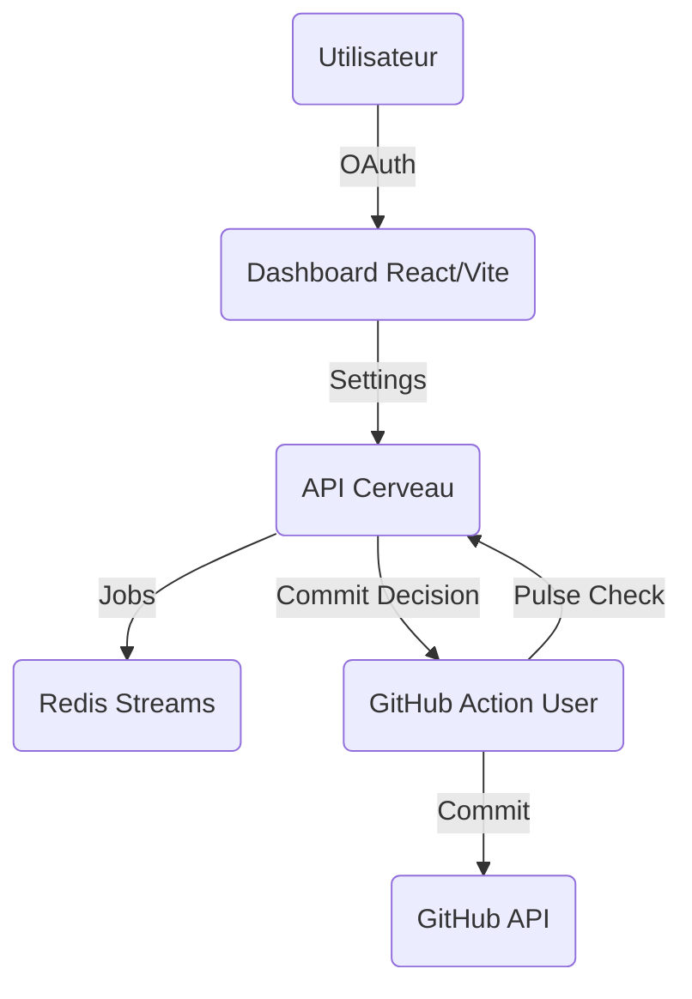

# Architecture Overview - KeepStreak

## Vision
KeepStreak est une infrastructure de maintien d'activité GitHub conçue pour être performante, sécurisée et décentralisée.

## Composants de haut niveau
- **KeepStreak Cerveau (Core)** : VPS Hostinger exécutant une API Node.js/Express.
- **Moteur de Queue (Redis)** : Gestion des jobs de commit et du jitter.
- **Réseau d'Ombres (Workers)** : GitHub Actions hébergées sur les repos des utilisateurs.

## Flux de Données

