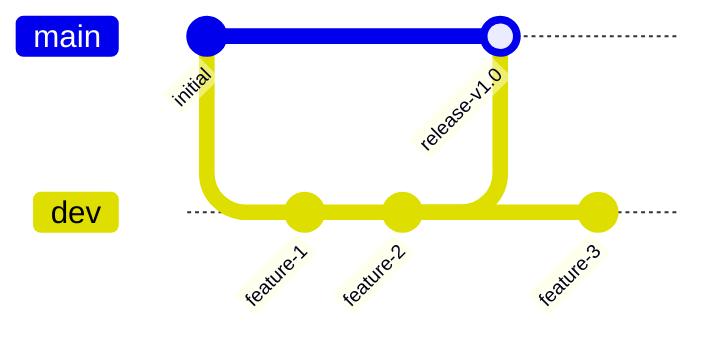

# CI/CD - Intégration Continue & Déploiement 🔄

Ce document décrit les pipelines d'automatisation pour KeepStreak.

---

## Workflows GitHub Actions

### 1. CI - Tests & Validation

**Fichier:** `.github/workflows/ci.yml`

```yaml
name: CI
on:
  push:
    branches: [main, dev]
  pull_request:
    branches: [main, dev]

jobs:
  lint-test:
    runs-on: ubuntu-latest
    steps:
      - uses: actions/checkout@v4
      - uses: pnpm/action-setup@v3
        with:
          version: 9
      - uses: actions/setup-node@v4
        with:
          node-version: '20'
          cache: 'pnpm'
      - run: pnpm install --frozen-lockfile
      - run: pnpm lint
      - run: pnpm test
      - run: pnpm build
```

### 2. Deploy API - VPS

**Fichier:** `.github/workflows/deploy-api.yml`

```yaml
name: Deploy API
on:
  push:
    branches: [main]
    paths:
      - 'apps/api/**'
      - 'packages/**'

jobs:
  deploy:
    runs-on: ubuntu-latest
    steps:
      - uses: actions/checkout@v4
      - name: Deploy to VPS
        uses: appleboy/ssh-action@v1
        with:
          host: ${{ secrets.VPS_HOST }}
          username: ${{ secrets.VPS_USER }}
          key: ${{ secrets.VPS_SSH_KEY }}
          script: |
            cd /opt/keepstreak
            git pull origin main
            docker compose up -d --build api
```

### 3. Deploy Dashboard - Vercel

Le dashboard Next.js est déployé automatiquement via l'intégration Vercel-GitHub.

---

## Stratégie de Branches



| Branche | Usage | Déploiement |
|---------|-------|-------------|
| `main` | Production | Automatique (VPS + Vercel) |
| `dev` | Développement | Preview Vercel |
| `feature/*` | Features | Preview Vercel |

---

## Secrets Requis

| Secret | Description |
|--------|-------------|
| `VPS_HOST` | Adresse IP du VPS |
| `VPS_USER` | Utilisateur SSH |
| `VPS_SSH_KEY` | Clé SSH privée (Ed25519) |
| `DATABASE_URL` | URL Neon PostgreSQL |
| `REDIS_URL` | URL Redis Cloud |

---

[⬅️ Retour au Build](index.md)
