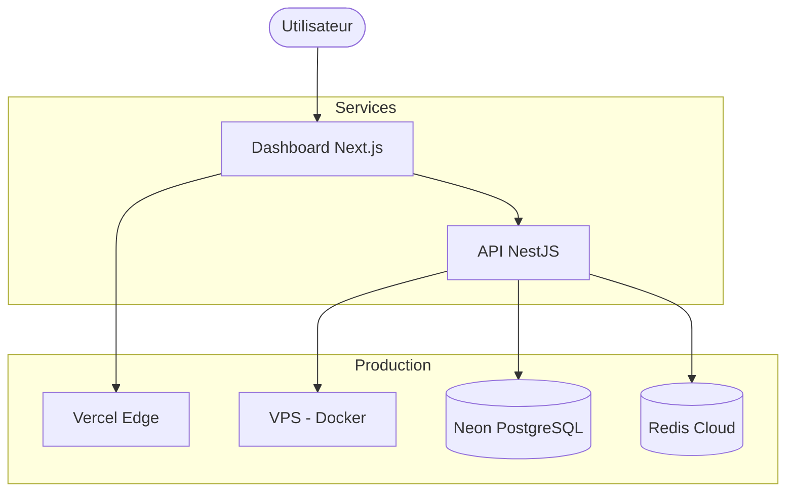

# Stratégie de Déploiement 🌐

Ce document décrit les stratégies de déploiement pour les composants de KeepStreak.

---

## Architecture de Déploiement



---

## 1. API NestJS - VPS Docker

### Infrastructure

| Composant | Spécification |
|-----------|---------------|
| **Provider** | Hetzner / DigitalOcean |
| **OS** | Ubuntu 24.04 LTS |
| **RAM** | 4 GB minimum |
| **Container** | Docker + Docker Compose |

### docker-compose.yml

```yaml
version: '3.8'
services:
  api:
    build:
      context: .
      dockerfile: apps/api/Dockerfile
    ports:
      - "3001:3001"
    environment:
      - DATABASE_URL=${DATABASE_URL}
      - REDIS_URL=${REDIS_URL}
      - JWT_SECRET=${JWT_SECRET}
      - ENCRYPTION_KEY=${ENCRYPTION_KEY}
    restart: always
    healthcheck:
      test: ["CMD", "curl", "-f", "http://localhost:3001/health"]
      interval: 30s
      timeout: 10s
      retries: 3

  redis-commander:
    image: rediscommander/redis-commander:latest
    environment:
      - REDIS_HOST=redis
    ports:
      - "8081:8081"
    profiles:
      - debug
```

### Dockerfile (apps/api/Dockerfile)

```dockerfile
FROM node:20-alpine AS builder
WORKDIR /app
RUN corepack enable pnpm

COPY pnpm-lock.yaml .
COPY pnpm-workspace.yaml .
COPY package.json .
COPY turbo.json .
COPY apps/api/package.json apps/api/
COPY packages/ packages/

RUN pnpm install --frozen-lockfile
COPY . .
RUN pnpm turbo build --filter=@keepstreak/api

FROM node:20-alpine AS runner
WORKDIR /app
COPY --from=builder /app/apps/api/dist ./dist
COPY --from=builder /app/node_modules ./node_modules
EXPOSE 3001
CMD ["node", "dist/main.js"]
```

---

## 2. Dashboard Next.js - Vercel

### Configuration

Le déploiement est automatique via l'intégration GitHub-Vercel.

**`apps/web/vercel.json`:**

```json
{
  "buildCommand": "cd ../.. && pnpm turbo build --filter=@keepstreak/web",
  "outputDirectory": ".next",
  "framework": "nextjs"
}
```

### Variables d'Environnement Vercel

| Variable | Description |
|----------|-------------|
| `NEXT_PUBLIC_API_URL` | URL de l'API production |
| `NEXTAUTH_SECRET` | Secret NextAuth.js |
| `GITHUB_CLIENT_ID` | OAuth GitHub |
| `GITHUB_CLIENT_SECRET` | OAuth GitHub |

---

## 3. Rollback Strategy

### VPS (API)

```bash
# Rollback vers une version précédente
docker compose down
git checkout <previous-commit>
docker compose up -d --build
```

### Vercel (Dashboard)

Rollback instantané via l'interface Vercel ou:

```bash
vercel rollback
```

---

[⬅️ Retour au Build](index.md)
