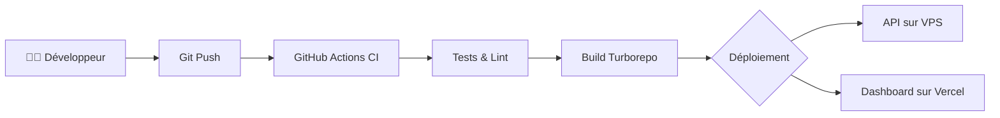

# Build & Déploiement 🚀

Ce dossier centralise la documentation liée au cycle de vie du build, à l'intégration continue et au déploiement de **KeepStreak**.

---

## Table des Matières

| Document | Description |
|----------|-------------|
| [CI/CD](CI_CD.md) | Pipelines GitHub Actions, tests automatisés et workflows de release |
| [Monorepo Management](monorepo-management.md) | Configuration Turborepo, gestion des workspaces et dépendances |
| [Stratégie de Déploiement](deployment-strategy.md) | Déploiement VPS (API) et Vercel (Dashboard) |
| [Environment Setup](environment-setup.md) | Configuration locale et gestion des secrets |

---

## Vue d'Ensemble

### Stack de Build

| Outil | Rôle |
|-------|------|
| **Turborepo** | Orchestration du monorepo, cache intelligent |
| **pnpm** | Gestionnaire de paquets, workspaces |
| **GitHub Actions** | CI/CD, automatisation |
| **Docker** | Conteneurisation de l'API |
| **Vercel** | Hébergement du frontend Next.js |

---

[⬅️ Retour à la Documentation](../index.md)
